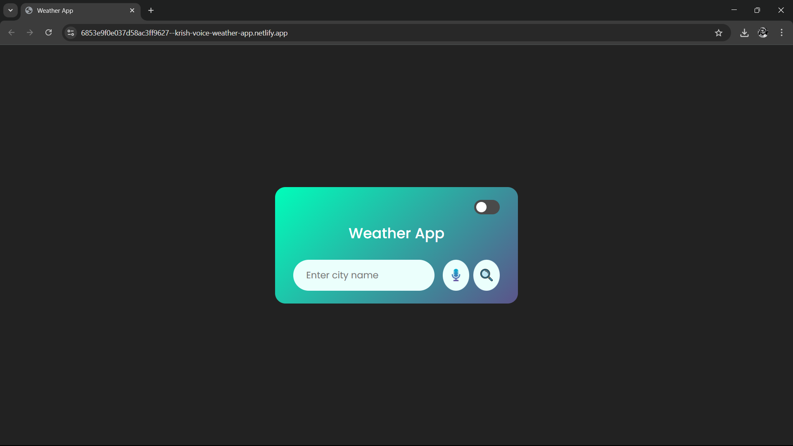
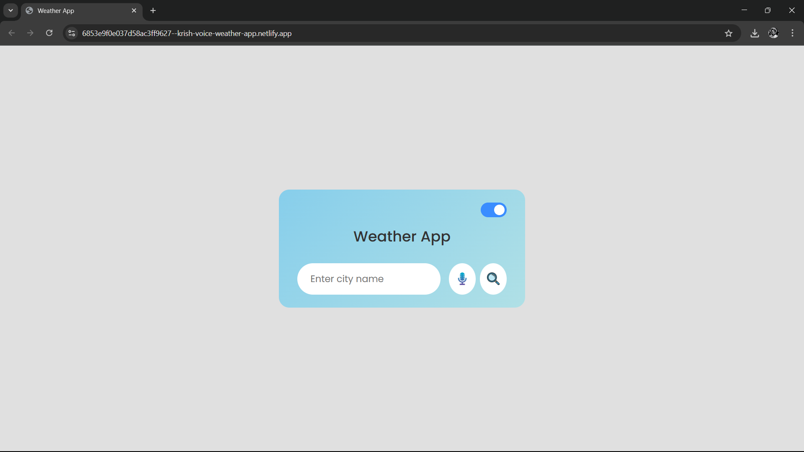
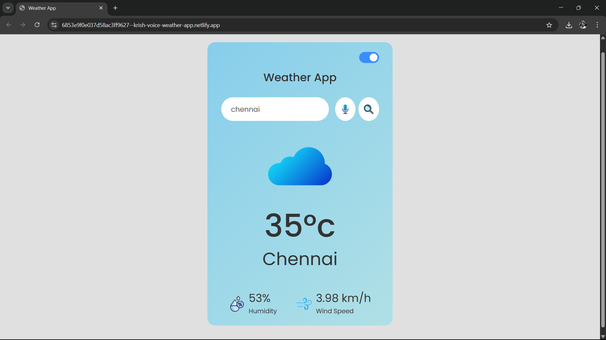

# ☀️ Voice-Enabled Weather App ☀️

A modern, responsive weather application built from the ground up using vanilla HTML, CSS, and JavaScript. This project fetches live data from the OpenWeatherMap API and showcases a range of dynamic, user-friendly features.

## 🚀 [**Live Demo Link**]([https://your-app-name.netlify.app](https://6853e9f0e037d58ac3ff9627--krish-voice-weather-app.netlify.app/)) 🚀

---

### ✨ Core Features

*   **Live Weather Data:** Instantly fetches and displays current weather information for any city in the world using the OpenWeatherMap API.
*   **🗣️ Voice Recognition Search:** A standout feature that allows users to search for a city by voice, implemented using the browser's Web Speech API.
*   **🌗 Dark/Light Theme:** A sleek theme toggle that switches the application's color scheme.
*   **💾 Persistent User Preferences:** The selected theme (dark or light) is saved to `localStorage`, so it persists across browser sessions.
*   **☁️ Dynamic Icons & UI:** The primary weather icon and UI elements dynamically update to reflect the current weather conditions (e.g., Clear, Clouds, Rain, Snow).
*   **📱 Fully Responsive Design:** Meticulously styled to provide an optimal user experience on all devices, from small mobile screens to large desktop monitors.
*   **⚙️ Graceful Error Handling:** Provides clear feedback to the user if a city cannot be found or if there is an API error.

### 📸 Screenshots

### 🛠️ Technology Stack

This project was built using core front-end technologies, with no external frameworks or libraries.

*   **HTML5:** For the structure and content.
*   **CSS3:** For styling and layout.
    *   **Flexbox:** For creating modern, responsive layouts.
    *   **CSS Variables:** For efficient and clean theming between dark and light modes.
    *   **Custom Transitions & Animations:** For smooth user interactions.
*   **Vanilla JavaScript (ES6+):** For all application logic.
    *   **Fetch API:** For making asynchronous network requests to the OpenWeatherMap API.
    *   **`async/await`:** To handle promises and asynchronous operations gracefully.
    *   **DOM Manipulation:** To dynamically update the UI with fetched data.
    *   **Web Speech API (`SpeechRecognition`):** To implement the voice search functionality.
    *   **`localStorage` API:** To store and retrieve user theme preferences.

---

### 🧠 What I Learned

This project was a fantastic learning experience that solidified my understanding of many key front-end concepts:

*   **API Integration:** The complete process of requesting, receiving, and parsing data from a third-party REST API.
*   **Asynchronous JavaScript:** Deepened my practical skills with `async/await` and managing the flow of asynchronous code.
*   **State Management:** Learned to manage application state (like the current theme) and persist it using browser storage.
*   **Advanced Browser APIs:** Gained hands-on experience with the Web Speech API, an exciting and less common browser feature.
*   **Professional Development Workflow:** Practiced the end-to-end development cycle, from initial setup to version control with Git/GitHub and final deployment on Netlify.

---

This project was built to demonstrate my skills in creating modern, interactive, and user-centric web applications from scratch.
